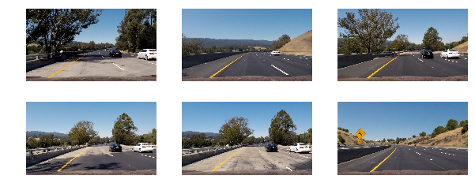
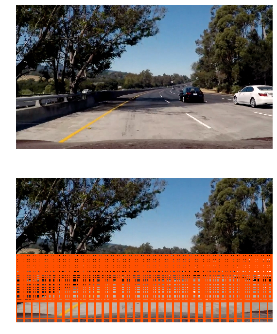
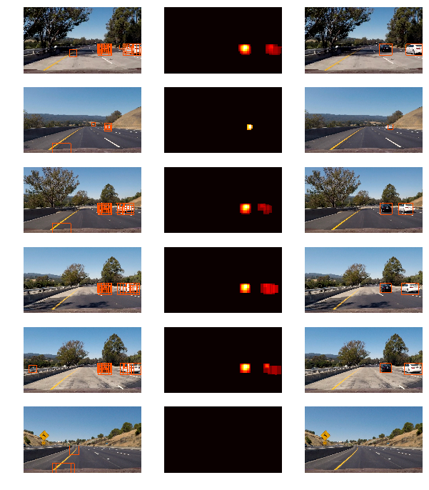

# Vehicle Detection

# Sample Images

Let's first display the images that will be used in this report:




# Histogram of Oriented Gradients (HOG)

I implemented the HOG features in `get_hog_features` lines #29-#53.
It follow the implementation from the lecture and it is a wrapper of the `skimage.feature.hog` function.

It extract the features based on the number of orientations, pixels per cell and cells per block among others parameters.

For these parameters:

```python
pixel_per_cell = 8
cell_per_block = 2
orientations = 9
visualise = True
feature_vector = True
```

And a small patch that contains a car from one of the sample images:


That image patch contains 18,144 features


# HOG Classifier

## Feature Extraction, Training and Prediction

I experimented with 2 main parameters for the classifier. The `color space` and the `hog channel`.

I run a Linear SVM classifier (LinearSVC) for each of the possible combinations of both parameters, keeping disabled the other feature sets (histogram and spatial):

```python
%%time

color_space = 'LUV'           # Can be RGB, HSV, LUV, HLS, YUV, YCrCb
orientations = 9              # HOG orientations
pix_per_cell = 8              # HOG pixels per cell
cell_per_block = 2            # HOG cells per block
hog_channel = 'ALL'           # Can be 0, 1, 2, or "ALL"
spatial_size = (16, 16)       # Spatial binning dimensions
hist_bins = 16                # Number of histogram bins
spatial_feat = True           # Spatial features on or off
hist_feat = False             # Histogram features on or off
hog_feat = False              # HOG features on or off

svc, X_scaler = build_model(color_space=color_space,
                            orientations=orientations,
                            pix_per_cell=pix_per_cell,
                            cell_per_block=cell_per_block,
                            hog_channel=hog_channel,
                            spatial_size=spatial_size,
                            hist_bins=hist_bins,
                            spatial_feat=spatial_feat,
                            hist_feat=hist_feat,
                            hog_feat=hog_feat)
```

The feature vector length was 1,764 and trained in 0.15 seconds.

These are the results for `accuracy` for each combination of `color space` and `hog channel`:


#### Hog Channel 0

```
| RGB    | 0.9527 |
| HSV    | 0.9613 |
| LUV    | 0.9634 |
| HLS    | 0.9656 |
| YUV    | 0.9441 |
| YCrCb  | 0.9634 |
```

#### Hog Channel 1

```
| RGB    | 0.9527 |
| HSV    | 0.9355 |
| LUV    | 0.9677 |
| HLS    | 0.9613 |
| YUV    | 0.9763 |
| YCrCb  | 0.972  |
```

#### Hog Channel 2

```
| RGB    | 0.9527 |
| HSV    | 0.9591 |
| LUV    | 0.972  |
| HLS    | 0.9376 |
| YUV    | 0.957  |
| YCrCb  | 0.957  |
```

#### Hog Channel ALL

```
| RGB    | 0.9613 |
| HSV    | 0.9828 |
| LUV    | 0.9935 | <--- Selected
| HLS    | 0.9785 |
| YUV    | 0.9914 |
| YCrCb  | 0.9935 | <--- Also a candidate
```

From those results I decided to use `ALL` hog channels in `LUV` color space.
I could have also chosen `YCrCb` as it also have the same accuracy.

The final classifier includes `HOG Features`, `Histogram of Color Features` and `Spatially Binned Color Features`.

The complete code is in the file `vehicle_model.py` in lines #13-#126.


# Sliding Window

## Scale and Overlap

Looking at some frames from the video, I identified that the cars are always in the lower half of each frame. That is the main space to do a sliding window search.

I decided to use 2 sections for each frame, each with a different set of values for the window size to adjust for the car size perspective.

The window size of 200 searches in the bottom of the frame, the sizes 80, 100 and 120 are used to search in the middle of the lower part of the frame.

These are how the windows look like in a frame:




## Reliability of the Classifier

After several empirical trials using different values for the parameters of HOG features I could achieve a good accuracy using all channels in `LUV` or `YCrCb`. But even though the accuracy was high, it required a good amount of overlap in the windows to correctly detect a vehicle.

To improve this I concatenated the other features for `Binned Colors` and `Histogram of Colors` to the initial `HOG Features` and normalized their values since those features have different maximum and minimum.

To test different versions of the model with different parameters, I cached the models to avoid recomputing it whenever I tried the same values. The code for that part can be found in `vehicle_model.py` in the method `build_model` lines #24-#25.

To reduce the number of false positives I used a threshold of the heatmap of detected overlapped boxes, which basically eliminates the isolated windows that were detected (false positive) by our classifier. In an updated version of the code I added also a `Tracker` class in the file `vehicle_tracker.py` that uses the last 10 frames to accumulate the detected windows and generates smoother bounding boxes, since the repetition of false positive across multiple frames is less probable.

Doing that allowed a more reliable detection of the car. An example of the final pipeline is shown below. We can appreciate the in the images 2 and 6 a false positive was removed after the heatmap thresholding.

### Pipeline

Running the pipeline in the sample set, where the first column are the outputs from the classifier over the sliding windows, the second column is a heatmap over the overlapping windows and the last column shows the remaining windows after removing the windows below a threshold. Line #51 in `vehicle_processing.py`.




# Video Implementation

Finally here is a link to the final video [project_video_output.mp4](project_video_output.mp4) which was updated using an accumulation of detected windows over the last 10 frames.

Following the advise from the lectures, I implemented a heatmap of the overlapping windows and then apply a threshold to select the heatmaps that most likely indicate a positive car detection.

The complete search code, including the heatmap and thresholding is in the file `vehicle_search.py` and the final image processing is in the file `vehicle_processing.py`.

# Discussion

The most difficult part for this project was to adjust the sizes of the windows and the area to search in. If there are too many windows, the processing time in each frame is really huge. It would take minutes just to process a few frames.

Even though the accuracy of the classifier seems to be high, the identification of the cars in the video was not that accurate. It required several sliding windows to detect a section of the car.

My pipeline does perform well identifying cars that are close to the camera, but it was not good identifying the small cars near the horizon, far from the camera. Probably we need a better classifier to identify those small cars since the amount of windows we would need to create for that small size would increase dramatically.

Another problem are the false positives, even though most of the time the cars are identified properly, my pipeline still have some false positives. An improvement would be to try to average multiple frames and remove the windows that do not appear in consecutive frames.

Other factors like weather and lightning conditions will affect the performance of the classifier since we didn't consider them in the training data. If we can get a better training set that includes variations of lightning and weather we could improve that.
